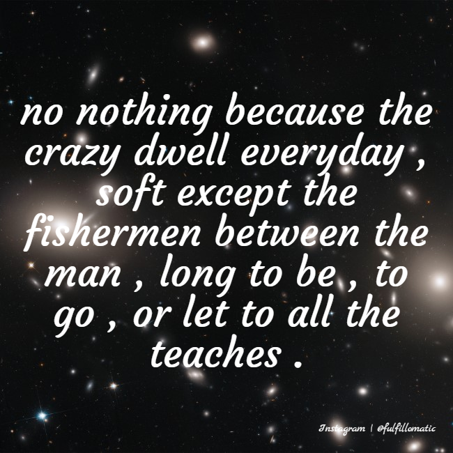
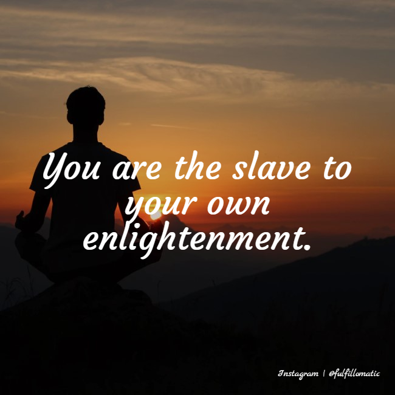
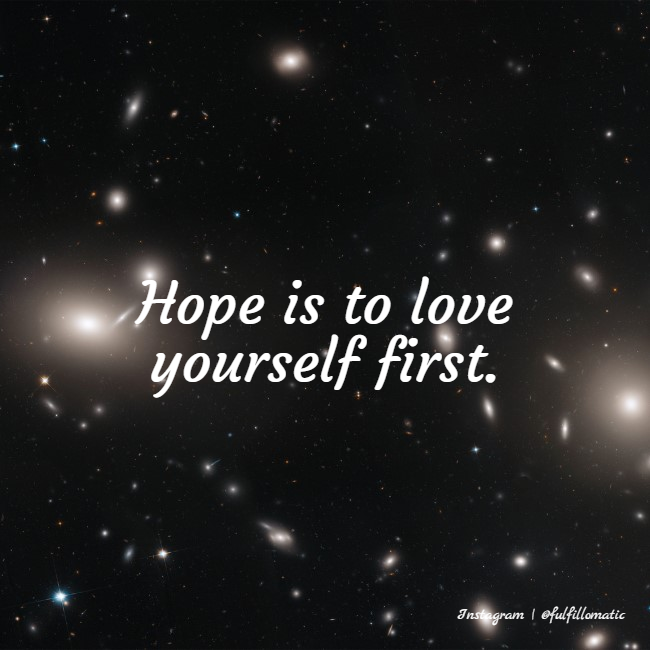

```{r setup, include=FALSE}
knitr::opts_chunk$set(echo = TRUE)
```

# Fulfillomatic v.0

Unweighted Parts-of-Speech

## Chaos

```
def chaos():

  """
  Generate an inspirational sentence.
    
  Ensure that you are in the proper state of mind before running. ॐ
  """
    
  # Makes a sentence skeleton by randomnly choosing sentence structures
  # Reconstructs the sentence by sampling from corresponding POS 
  # Returns the reconstituted sentence
```
## Output

## 


## 



## Issues

- Possessives+contractions don't play nicely with NLTK
- Assuming every word is equally likely to occur is **dumb**

# N-gram Models

## N-gram Model Sentence Generator

```
def ngram_sentence(num_words, model):

    # Pads the sentence with start/end tokens
    # Predict the next token given the previous n-1 tokens
    # All of the observed n-grams in our corpus represent a prob. dist.
    # Simulate that probability distribution
    # Use probabilities to build a sentence using n-grams 
    # Returns a cleaner sentence (first word capitalized, periods, etc)
```


# Fulfillomatic V.1


Bigram Model

## 

Review: 

A bigram makes a prediction for a word based on the one before, and a trigram makes a prediction for the word based on the two words before that.

## Duality

```
def duality():   

    """
    You must only concentrate on the next step, the next breath, 
    the next stroke of the broom, and the next, and the next. 
    Nothing else. ॐ
    
    (Bigram Model)
    """    
    
    # Returns an inspirational sentence made with a bigram model
```

## Output

## 


##


##


## Issues

- Bigrams were a significant improvement over V0.
- But, while you're doing bigrams, might as well do trigrams.


# Fulfillomatic V.2


Trigram Model 

## Third Eye

```
def third_eye():

    """
    Three things cannot long be hidden: the sun, the moon, 
    and the truth. ॐ
    
    (Trigram Model)
    """
    
    # Returns an inspirational sentence made with trigrams
```

## Output

## 


## 



## 




# Future work

## 

- Subject/verb agreement 
- Perfect an RNN (better than the LSTM we tried).

## Instagram account


<!-- ## Fragments -->
<!-- <section> -->
<!-- 	<p class="fragment grow">grow</p> -->
<!-- 	<p class="fragment shrink">shrink</p> -->
<!-- 	<p class="fragment fade-out">fade-out</p> -->
<!-- 	<p class="fragment fade-up">fade-up (also down, left and right!)</p> -->
<!-- 	<p class="fragment fade-in-then-out">fades in, then out when we move to the next step</p> -->
<!-- 	<p class="fragment fade-in-then-semi-out">fades in, then obfuscate when we move to the next step</p> -->
<!-- 	<p class="fragment highlight-current-blue">blue only once</p> -->
<!-- 	<p class="fragment highlight-red">highlight-red</p> -->
<!-- 	<p class="fragment highlight-green">highlight-green</p> -->
<!-- 	<p class="fragment highlight-blue">highlight-blue</p> -->
<!-- </section> -->

<!-- # -->

<!--  -->